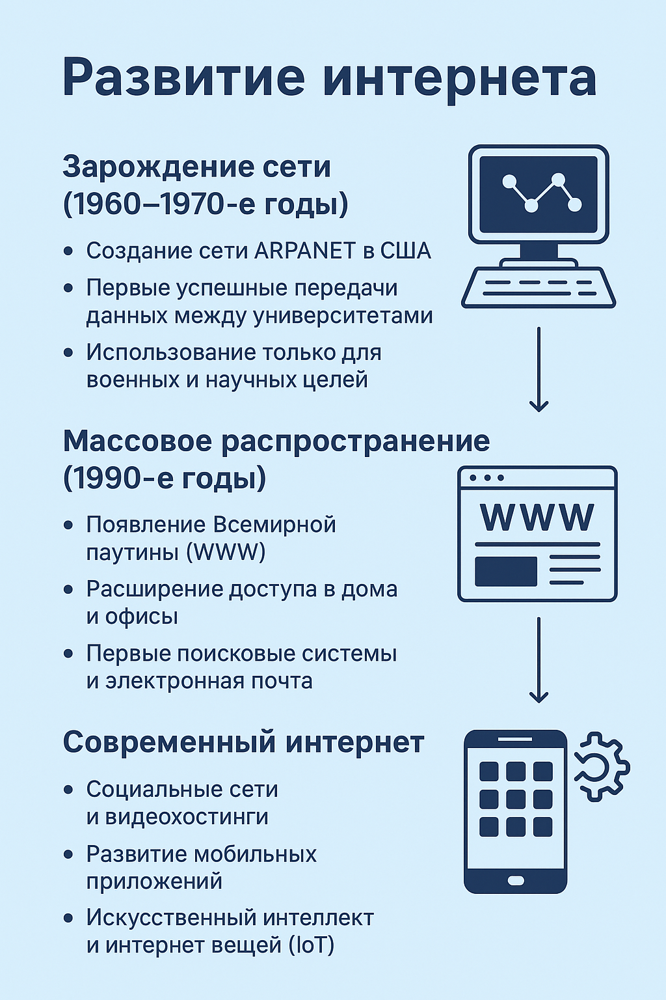

# Развитие интернета

## Введение
Интернет изменил мир: он стал главным источником информации и средством общения для миллионов людей.

## Основные этапы

### 1. Зарождение сети (1960–1970-е годы)
- Создание сети ARPANET в США
- Первые успешные передачи данных между университетами
- Использование только для военных и научных целей

### 2. Массовое распространение (1990-е годы)
- Появление Всемирной паутины (WWW)
- Расширение доступа в дома и офисы
- Первые поисковые системы и электронная почта

### 3. Современный интернет
- Социальные сети и видеохостинги
- Развитие мобильных приложений
- Искусственный интеллект и интернет вещей (IoT)

## Заключение
Интернет продолжает эволюционировать и всё глубже интегрируется в жизнь общества.

